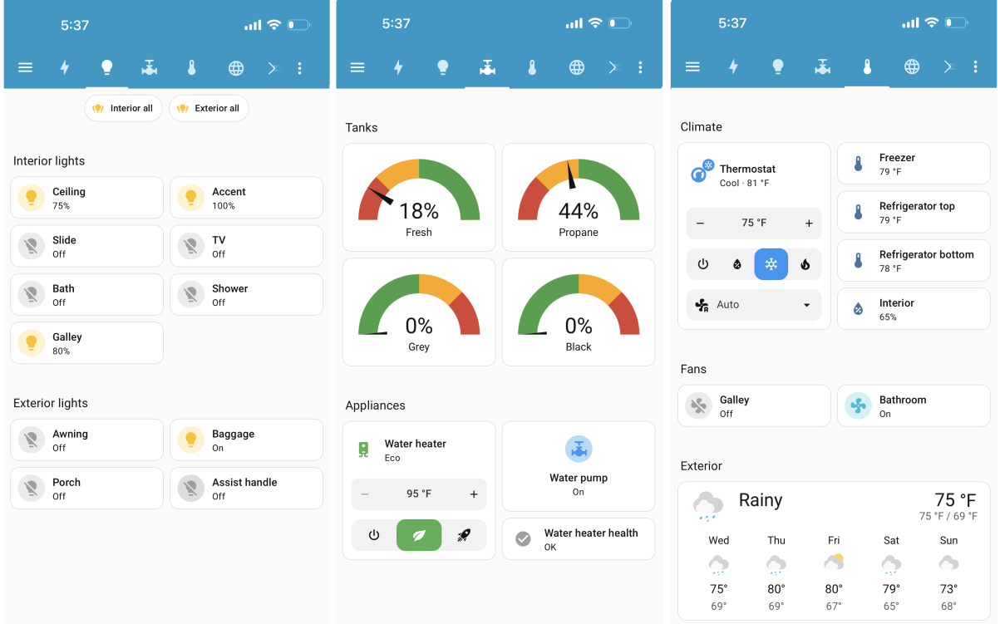

# SUMMARY

This project provides two-way communication between an RV CAN bus network and an MQTT message broker, along with autodiscovery messages for Home Assistant.  While theoretically it can be used for many different RVs, this version is specifically tailored for a 2023 Leisure Travel Van (LTV).  That RV has a Firefly G12 panel, Truma Aventa AC, Truma VarioHeat furance, Truma AquaGo water heater, Dometic Fan-Tastic vent fans, and SeeLevel Soul tank sensors. The awning and slideout on the LTV are not controlled by the Firefly, so they are not addressed in this project.  I removed the generator from my LTV, so I did not attempt to control it in this project.

Unfortunately, I was not successful in getting the climate control to operate the air conditioner.  The climate control operates the furnace fine and the climate control will correctly report the operating status of the air conditioner.  But it will not allow me to turn the air conditioner on/off.  When I tested it, it would send the proper command to turn on, but then the Firefly would immediately send another command to turn off.  I gave up and moved onto other tasks since I plan to eventually replace the air conditioner.

This project is spawned from https://github.com/spbrogan/rvc2mqtt#.  I simply tailored the code specifically for the equipment found on my LTV.

Please read [this overview](docs/overview.md) and other docs in the /docs folder to understand how the application works and how you need to configure your floorplan file.

For novices (like me) I prepared [this "cheat-sheet"](docs/pi_setup.md) in the /docs folder, which walks you through the steps to install the required software onto a Raspberry Pi.

## WARNING

No guarantees or warranties. This software can be used to control physical devices on your RV CAN bus and makes no promises about the safety or security of those operations.  Use at your own risk!

## License

All content in this repository is licensed under [Apache 2 License](LICENSE).

